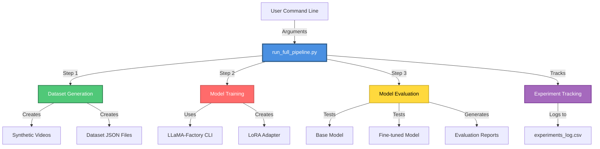
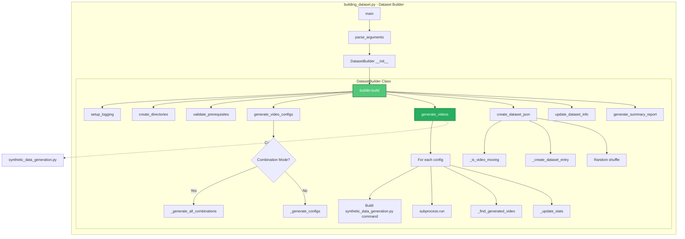
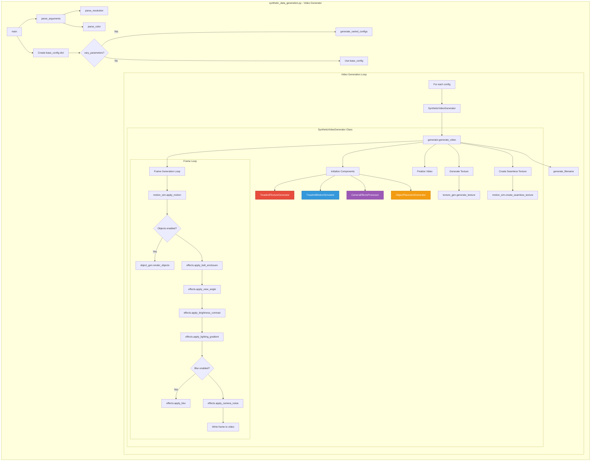
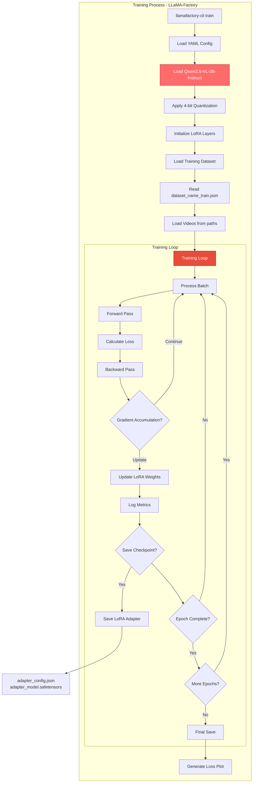
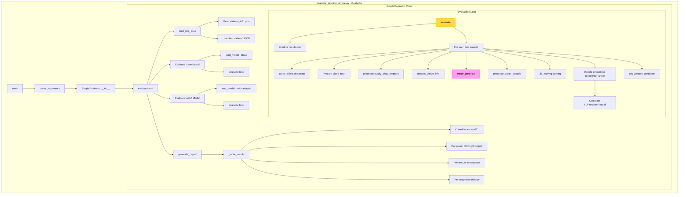

# Complete Pipeline Block Diagram - run_full_pipeline

This document provides a comprehensive block diagram of the entire `run_full_pipeline.py` system, including all related files, classes, and functions.

## High-Level System Architecture



## Detailed Component Architecture

### 1. Main Orchestrator: run_full_pipeline.py

```mermaid
graph TB
    subgraph "run_full_pipeline.py - Main Orchestrator"
        Main[main Function] --> ParseArgs[parse_arguments]
        ParseArgs --> CreateRunner[FullPipelineRunner __init__]
        CreateRunner --> RunPipeline[runner.run]

        subgraph "FullPipelineRunner Class"
            RunPipeline --> InitTracker[ExperimentTracker.start_experiment]
            RunPipeline --> Step1[step1_generate_datasets]
            RunPipeline --> Step2[step2_train_model]
            RunPipeline --> Step3[step3_evaluate_models]
            RunPipeline --> Finalize[tracker.finalize_experiment]

            Step1 --> BuildTrainCmd[_build_dataset_command for train]
            Step1 --> BuildTestCmd[_build_dataset_command for test]
            Step1 --> RunCmd1[run_command - Train Dataset]
            Step1 --> RunCmd2[run_command - Test Dataset]

            Step2 --> CreateConfig[_create_training_config]
            Step2 --> RunTrain[run_command - Training]
            CreateConfig --> YAMLFile[qwen25vl_lora_pipeline_{timestamp}.yaml]

            Step3 --> RunEval[run_command - Evaluation]
            Step3 --> ParseResults[parse_evaluation_results]
            Step3 --> UpdateResults[tracker.update_evaluation_results]
        end
    end

    style RunPipeline fill:#4a90e2,stroke:#2e5c8a,stroke-width:2px,color:#fff
    style Step1 fill:#50c878,stroke:#2e7d50,stroke-width:2px,color:#fff
    style Step2 fill:#ff6b6b,stroke:#cc5555,stroke-width:2px,color:#fff
    style Step3 fill:#ffd93d,stroke:#ccae31,stroke-width:2px,color:#000
```

**Key Functions:**
- `main()`: Entry point, parses arguments and creates FullPipelineRunner
- `parse_arguments()`: Parses 60+ command-line arguments for dataset, training, and evaluation
- `FullPipelineRunner.__init__()`: Initializes paths, timestamps, ExperimentTracker
- `FullPipelineRunner.run()`: Main execution loop coordinating all 3 steps
- `FullPipelineRunner.run_command()`: Subprocess executor with logging
- `FullPipelineRunner.step1_generate_datasets()`: Orchestrates dataset generation
- `FullPipelineRunner._build_dataset_command()`: Builds building_dataset.py command
- `FullPipelineRunner.step2_train_model()`: Creates training config and runs training
- `FullPipelineRunner._create_training_config()`: Generates YAML config for LLaMA-Factory
- `FullPipelineRunner.step3_evaluate_models()`: Runs evaluation and parses results

### 2. Dataset Generation: building_dataset.py



**Key Functions:**
- `main()`: Entry point for dataset builder
- `parse_arguments()`: Parses dataset generation parameters (texture, speed, resolution, etc.)
- `DatasetBuilder.__init__()`: Initializes paths, RNG, statistics tracking
- `DatasetBuilder.build()`: Main pipeline: setup → generate → format → register
- `DatasetBuilder.validate_prerequisites()`: Checks synthetic_data_generation.py and Python
- `DatasetBuilder.generate_video_configs()`: Creates video parameter configurations
- `DatasetBuilder._generate_all_combinations()`: Generates all combinations for comma-separated params
- `DatasetBuilder._generate_configs()`: Generates configs with parameter variation
- `DatasetBuilder.generate_videos()`: Calls synthetic_data_generation.py for each config
- `DatasetBuilder._find_generated_video()`: Locates generated MP4 files
- `DatasetBuilder.create_dataset_json()`: Creates ShareGPT format JSON
- `DatasetBuilder._is_video_moving()`: Extracts speed from filename
- `DatasetBuilder._create_dataset_entry()`: Creates messages/videos JSON structure
- `DatasetBuilder.update_dataset_info()`: Updates data/dataset_info.json
- `DatasetBuilder.generate_summary_report()`: Creates summary with statistics

### 3. Synthetic Video Generation: synthetic_data_generation.py



**Key Classes and Methods:**

#### TreadmillTextureGenerator
- `__init__(width, height, seed)`: Initialize with dimensions and random seed
- `generate_stripes()`: Creates stripe pattern (perpendicular to motion)
- `generate_noise_pattern()`: Perlin-like noise for rough surfaces
- `generate_rubber_pattern()`: Rubber texture with bumps
- `generate_grid_pattern()`: Grid/tile pattern
- `generate_diamond_plate()`: Metal tread plate texture
- `generate_factory_dark()`: Dark industrial belt (no stripes)
- `generate_factory_dark_stripes()`: Dark industrial belt with stripes
- `generate_subtle_gray_stripes()`: Low-contrast gray stripes for detection challenge
- `generate_texture(texture_type, **kwargs)`: Main dispatcher

#### TreadmillMotionSimulator
- `__init__(width, height, direction, speed)`: Initialize motion parameters
- `create_seamless_texture()`: Tiles texture 2x for infinite scrolling
- `apply_motion(texture, frame_index)`: Translates texture based on frame and speed

#### CameraEffectsProcessor
- `__init__(width, height, seed)`: Initialize effects processor
- `apply_view_angle(frame, angle_degrees)`: Perspective transform
- `apply_brightness_contrast(frame, brightness, contrast)`: Color adjustments
- `apply_lighting_gradient(frame, variation_type, intensity)`: Vignette, gradients, spotlight
- `apply_motion_blur(frame, direction, blur_amount)`: Directional motion blur
- `apply_gaussian_blur(frame, blur_intensity)`: Out-of-focus blur
- `apply_blur(frame, blur_type, blur_intensity, direction)`: Unified blur dispatcher
- `apply_camera_noise(frame, noise_level)`: Sensor noise
- `apply_belt_enclosure(frame, edge_width_percent, ...)`: Adds realistic frame/edges

#### ObjectPlacementGenerator
- `__init__(width, height, seed, direction, speed)`: Initialize with motion tracking
- `initialize_objects(num_objects, object_type, object_size, position, ...)`: Create objects
- `_get_position_coordinates(position, object_size, edge_width)`: Calculate placement
- `_parse_size(size)`: Parse size descriptors to pixels
- `place_box(frame, position, size, color)`: Render box object
- `place_circle(frame, position, size, color)`: Render circular object
- `update_object_positions()`: Move objects with belt motion
- `render_objects(frame)`: Render all tracked objects

#### SyntheticVideoGenerator
- `__init__(config)`: Initialize all sub-components
- `generate_video(output_path)`: Main generation pipeline
- `generate_filename(config, video_idx)`: Create descriptive filename

**Helper Functions:**
- `parse_arguments()`: Parse 30+ command-line parameters
- `parse_resolution(resolution_str)`: Parse "WxH" format
- `parse_color(color_str)`: Parse "R,G,B" format
- `generate_varied_configs(base_config, num_videos)`: Auto-vary parameters

### 4. Model Training: LLaMA-Factory CLI



**Training Configuration (YAML):**
- Model: `Qwen/Qwen2.5-VL-3B-Instruct`
- Method: Supervised Fine-Tuning (SFT) with LoRA
- LoRA Config: rank=8, alpha=16, dropout=0.05, target=all
- Quantization: 4-bit (bitsandbytes)
- Training: batch_size=1, grad_accum=8, lr=5e-5
- Optimizer: AdamW with cosine scheduler
- Precision: FP16/BF16
- Checkpointing: Every N steps

### 5. Model Evaluation: evaluate_pipeline_simple.py



**Key Functions:**
- `main()`: Entry point for evaluation
- `parse_arguments()`: Parse model paths, dataset, output dir, inference params
- `SimpleEvaluator.__init__()`: Initialize paths and load dataset_info.json
- `SimpleEvaluator.run()`: Main evaluation pipeline
- `SimpleEvaluator.load_model(model_path, adapter_path)`: Load model with 4-bit quantization ± LoRA
- `SimpleEvaluator.load_test_data()`: Load test JSON from dataset
- `SimpleEvaluator.evaluate(model, processor, data, model_name)`: Main evaluation loop
- `SimpleEvaluator.parse_video_metadata(video_path)`: Extract texture/angle from filename
- `SimpleEvaluator._is_moving(text)`: Parse model output for yes/no/moving/stopped
- `SimpleEvaluator.generate_report(base_results, lora_results)`: Generate text report
- `SimpleEvaluator._write_results(f, title, results)`: Write metrics to file

**Metrics Tracked:**
- Overall: Accuracy, F1 Score, Precision, Recall
- Per-class: Moving (correct/total), Stopped (correct/total)
- Per-texture: Accuracy, F1, correct/total for each texture type
- Per-angle: Accuracy, F1, correct/total for each viewing angle

### 6. Experiment Tracking: experiment_tracker.py

```mermaid
graph TB
    subgraph "experiment_tracker.py - Experiment Logger"
        Create[ExperimentTracker.__init__] --> EnsureCSV[_ensure_csv_exists]

        Pipeline[run_full_pipeline.py] -->|Start| StartExp[tracker.start_experiment]
        StartExp --> GetID[_get_next_experiment_id]
        StartExp --> PrepData[Prepare experiment_data dict]
        StartExp --> AppendRow[_append_or_update_row]

        Pipeline -->|Update| UpdateStat[tracker.update_status]
        UpdateStat --> UpdateCol[_update_column]

        Pipeline -->|Finish| UpdateEval[tracker.update_evaluation_results]
        UpdateEval --> ParseRes[Parse base/finetuned results]
        UpdateEval --> ExtractMetrics[Extract metrics]
        UpdateEval --> JSONSummary[Create JSON summaries]
        UpdateEval --> MultUpdate[Multiple _update_column calls]

        Pipeline -->|Complete| FinalizeExp[tracker.finalize_experiment]

        EvalPipeline[evaluate_pipeline_simple.py] --> ParseEvalRes[parse_evaluation_results]
        ParseEvalRes --> ReadReport[Read evaluation_report_*.txt]
        ParseEvalRes --> RegexParse[Regex parsing]
        ParseEvalRes --> ReturnDicts[Return base/finetuned dicts]
    end

    AppendRow --> CSV[experiments_log.csv]
    UpdateCol --> CSV
    MultUpdate --> CSV

    style StartExp fill:#a569bd,stroke:#7d3c98,stroke-width:2px,color:#fff
    style UpdateEval fill:#9b59b6,stroke:#8e44ad,stroke-width:2px,color:#fff
    style CSV fill:#f8b739,stroke:#ca8f0c,stroke-width:2px,color:#000
```



**Key Functions:**
- `ExperimentTracker.__init__(csv_path)`: Initialize tracker with CSV file
- `ExperimentTracker._ensure_csv_exists()`: Create CSV with 179 columns if missing
- `ExperimentTracker._get_next_experiment_id()`: Read CSV and increment max ID
- `ExperimentTracker.start_experiment(args)`: Log all initial parameters
- `ExperimentTracker.update_status(stage, status)`: Update dataset/training/evaluation status
- `ExperimentTracker.update_evaluation_results(base, finetuned)`: Log all evaluation metrics
- `ExperimentTracker._append_or_update_row(data)`: Write/update CSV row
- `ExperimentTracker._update_column(experiment_id, column, value)`: Update single column
- `ExperimentTracker.finalize_experiment()`: Mark experiment complete
- `parse_evaluation_results(output_dir)`: Parse evaluation report with regex

**CSV Columns (179 total):**
- Metadata: experiment_id, timestamp, run_timestamp
- Dataset: dataset_name, train/test names, num_videos, train_split, seed
- Train Dataset Params (26): texture, direction, angles, speed, resolution, FPS, etc.
- Test Dataset Params (26): texture, direction, angles, speed, resolution, FPS, etc.
- Model Config: model_name_or_path, template
- LoRA Config: rank, alpha, dropout, cutoff_len
- Training Hyperparams: batch size, learning rate, epochs, scheduler, etc.
- Evaluation Config: max_tokens, batch_size, video_fps, etc.
- Pipeline Control: skip flags, use_docker
- Status: dataset_status, training_status, evaluation_status
- Base Model Results: accuracy, F1, precision, recall, per-class counts
- Finetuned Model Results: accuracy, F1, precision, recall, per-class counts
- Detailed Breakdowns (JSON): per-texture and per-angle results
- Manual Notes: notes_1, notes_2

## Complete Data Flow

```mermaid
graph TB
    User[User] -->|CLI Arguments| Main[run_full_pipeline.py]

    subgraph "Step 1: Dataset Generation"
        Main -->|subprocess| Building[building_dataset.py]
        Building -->|subprocess| Synthetic[synthetic_data_generation.py]

        Synthetic -->|Generates| Videos1[Training Videos MP4]
        Synthetic -->|Generates| Videos2[Test Videos MP4]

        Building -->|Creates| JSON1[train_dataset.json]
        Building -->|Creates| JSON2[test_dataset.json]
        Building -->|Updates| InfoJSON[data/dataset_info.json]
    end

    subgraph "Step 2: Training"
        Main -->|Creates| YAMLConfig[training_config.yaml]
        Main -->|subprocess| LLaMA[llamafactory-cli train]

        YAMLConfig --> LLaMA
        JSON1 --> LLaMA
        Videos1 --> LLaMA

        LLaMA -->|Saves| LoRA[LoRA Adapter Files]
        LLaMA -->|Generates| Logs[Training Logs]
        LLaMA -->|Generates| LossPlot[Loss Plot]
    end

    subgraph "Step 3: Evaluation"
        Main -->|subprocess| Eval[evaluate_pipeline_simple.py]

        JSON2 --> Eval
        Videos2 --> Eval
        LoRA --> Eval

        Eval -->|Loads| BaseModel[Qwen2.5-VL-3B Base]
        Eval -->|Loads| FinetunedModel[Base + LoRA Adapter]

        Eval -->|Generates| Report[evaluation_report.txt]
        Eval -->|Generates| Details[detailed_predictions.csv]
    end

    subgraph "Experiment Tracking"
        Main -->|Initializes| Tracker[ExperimentTracker]
        Tracker -->|Logs| ExpCSV[experiments_log.csv]

        Main -->|Updates status| Tracker
        Eval -->|Returns results| Main
        Main -->|Logs results| Tracker
    end

    Report -->|Parsed by| ParseFunc[parse_evaluation_results]
    ParseFunc -->|Returns| MetricsDict[Results Dictionaries]
    MetricsDict --> Tracker

    style Main fill:#4a90e2,stroke:#2e5c8a,stroke-width:3px,color:#fff
    style Building fill:#50c878,stroke:#2e7d50,stroke-width:2px,color:#fff
    style Synthetic fill:#27ae60,stroke:#1e8449,stroke-width:2px,color:#fff
    style LLaMA fill:#ff6b6b,stroke:#cc5555,stroke-width:2px,color:#fff
    style Eval fill:#ffd93d,stroke:#ccae31,stroke-width:2px,color:#000
    style Tracker fill:#a569bd,stroke:#7d3c98,stroke-width:2px,color:#fff
```



## File System Structure

```
LLaMA-Factory/
├── run_full_pipeline.py              # Main orchestrator script
├── building_dataset.py                # Dataset builder
├── evaluate_pipeline_simple.py        # Evaluation script
├── experiment_tracker.py              # Experiment logging
│
├── data/
│   ├── dataset_info.json             # Dataset registry
│   ├── {dataset_name}_train.json     # Training dataset
│   ├── {dataset_name}_test.json      # Test dataset
│   ├── {dataset_name}_train/         # Training videos
│   │   └── *.mp4
│   ├── {dataset_name}_test/          # Test videos
│   │   └── *.mp4
│   └── synthetic_treadmill/
│       └── synthetic_data_generation.py  # Video generator
│
├── examples/train_qlora/
│   └── qwen25vl_lora_pipeline_{timestamp}.yaml  # Training config
│
├── saves/
│   └── {lora_output_dir}/            # LoRA adapter output
│       ├── adapter_config.json
│       ├── adapter_model.safetensors
│       ├── training_loss.png
│       └── trainer_log.jsonl
│
├── evaluation_results_{timestamp}/   # Evaluation output
│   ├── evaluation_report_{timestamp}.txt
│   └── detailed_predictions.csv
│
└── experiments_log.csv                # Experiment tracking CSV
```

## Execution Flow with Function Calls

### Complete Pipeline Execution

```
1. User executes: python3 run_full_pipeline.py --dataset_name exp1 --num_videos 100

2. run_full_pipeline.py::main()
   ├─> parse_arguments() → args
   ├─> FullPipelineRunner(args)
   │   ├─> ExperimentTracker.__init__('experiments_log.csv')
   │   │   └─> _ensure_csv_exists()
   │   └─> Variables: timestamp, dataset names, paths
   │
   └─> runner.run()
       ├─> tracker.start_experiment(args)
       │   ├─> _get_next_experiment_id() → experiment_id
       │   ├─> Prepare experiment_data dict (179 columns)
       │   └─> _append_or_update_row(experiment_data)
       │
       ├─> step1_generate_datasets()
       │   ├─> tracker.update_status('dataset', 'in_progress')
       │   ├─> Calculate train/test split
       │   ├─> _build_dataset_command(train_name, num_train, seed)
       │   │   └─> Build: ['python3', 'building_dataset.py', '--dataset_name', ...]
       │   ├─> run_command(train_cmd, "Training Dataset Generation")
       │   │   └─> subprocess.run(train_cmd)
       │   │       │
       │   │       └─> building_dataset.py::main()
       │   │           ├─> parse_arguments() → args
       │   │           ├─> DatasetBuilder(args)
       │   │           │   └─> Initialize: paths, stats, RNG
       │   │           └─> builder.build()
       │   │               ├─> create_directories()
       │   │               ├─> setup_logging()
       │   │               ├─> validate_prerequisites()
       │   │               ├─> generate_video_configs()
       │   │               │   ├─> Check combination mode
       │   │               │   ├─> _generate_all_combinations() OR
       │   │               │   └─> _generate_configs(num_moving) + _generate_configs(num_stopped)
       │   │               ├─> generate_videos(all_configs)
       │   │               │   └─> For each config:
       │   │               │       ├─> Build cmd: ['python3', 'synthetic_data_generation.py', ...]
       │   │               │       ├─> subprocess.run(cmd)
       │   │               │       │   │
       │   │               │       │   └─> synthetic_data_generation.py::main()
       │   │               │       │       ├─> parse_arguments() → args
       │   │               │       │       ├─> parse_resolution(args.resolution)
       │   │               │       │       ├─> parse_color(args.background_color)
       │   │               │       │       ├─> Create base_config dict
       │   │               │       │       ├─> Create output directory
       │   │               │       │       ├─> generate_varied_configs() OR use base_config
       │   │               │       │       └─> For each config:
       │   │               │       │           ├─> SyntheticVideoGenerator(config)
       │   │               │       │           │   ├─> TreadmillTextureGenerator(w, h, seed)
       │   │               │       │           │   ├─> TreadmillMotionSimulator(w, h, dir, speed)
       │   │               │       │           │   ├─> CameraEffectsProcessor(w, h, seed)
       │   │               │       │           │   └─> ObjectPlacementGenerator(w, h, seed, dir, speed)
       │   │               │       │           └─> generator.generate_video(output_path)
       │   │               │       │               ├─> texture_gen.generate_texture(type, **kwargs)
       │   │               │       │               │   └─> generate_stripes/noise/rubber/...()
       │   │               │       │               ├─> motion_sim.create_seamless_texture(texture)
       │   │               │       │               ├─> cv2.VideoWriter()
       │   │               │       │               ├─> object_gen.initialize_objects() [if enabled]
       │   │               │       │               └─> For each frame:
       │   │               │       │                   ├─> motion_sim.apply_motion(texture, frame_idx)
       │   │               │       │                   ├─> object_gen.render_objects() [if enabled]
       │   │               │       │                   ├─> object_gen.update_object_positions()
       │   │               │       │                   ├─> effects.apply_belt_enclosure()
       │   │               │       │                   ├─> effects.apply_view_angle()
       │   │               │       │                   ├─> effects.apply_brightness_contrast()
       │   │               │       │                   ├─> effects.apply_lighting_gradient()
       │   │               │       │                   ├─> effects.apply_blur() [if enabled]
       │   │               │       │                   ├─> effects.apply_camera_noise()
       │   │               │       │                   └─> video_writer.write(frame)
       │   │               │       │
       │   │               │       ├─> _find_generated_video(config)
       │   │               │       └─> _update_stats(config)
       │   │               ├─> create_dataset_json(video_files)
       │   │               │   └─> For each video:
       │   │               │       ├─> _is_video_moving(video_path)
       │   │               │       └─> _create_dataset_entry(video_rel_path, is_moving)
       │   │               ├─> update_dataset_info()
       │   │               └─> generate_summary_report()
       │   │
       │   ├─> _build_dataset_command(test_name, num_test, seed+10000)
       │   ├─> run_command(test_cmd, "Test Dataset Generation")
       │   └─> tracker.update_status('dataset', 'completed')
       │
       ├─> step2_train_model()
       │   ├─> tracker.update_status('training', 'in_progress')
       │   ├─> _create_training_config()
       │   │   ├─> Create YAML content with all hyperparameters
       │   │   └─> Write to examples/train_qlora/qwen25vl_lora_pipeline_{timestamp}.yaml
       │   ├─> Build cmd: ['llamafactory-cli', 'train', config_path]
       │   ├─> run_command(cmd, "LoRA Model Training")
       │   │   └─> subprocess.run(['llamafactory-cli', 'train', ...])
       │   │       │
       │   │       └─> LLaMA-Factory Training Process
       │   │           ├─> Load config YAML
       │   │           ├─> Load base model: Qwen/Qwen2.5-VL-3B-Instruct
       │   │           ├─> Apply 4-bit quantization (BitsAndBytes)
       │   │           ├─> Initialize LoRA layers (rank=8, alpha=16)
       │   │           ├─> Load training dataset from dataset_info.json
       │   │           ├─> Training loop (num_train_epochs):
       │   │           │   └─> For each batch:
       │   │           │       ├─> Forward pass
       │   │           │       ├─> Calculate loss
       │   │           │       ├─> Backward pass
       │   │           │       ├─> Gradient accumulation
       │   │           │       ├─> Update LoRA weights
       │   │           │       ├─> Log metrics (every logging_steps)
       │   │           │       └─> Save checkpoint (every save_steps)
       │   │           ├─> Save final LoRA adapter
       │   │           └─> Generate training_loss.png
       │   │
       │   └─> tracker.update_status('training', 'completed')
       │
       ├─> step3_evaluate_models()
       │   ├─> tracker.update_status('evaluation', 'in_progress')
       │   ├─> Build cmd: ['python3', 'evaluate_pipeline_simple.py', ...]
       │   ├─> run_command(cmd, "Model Evaluation")
       │   │   └─> subprocess.run(['python3', 'evaluate_pipeline_simple.py', ...])
       │   │       │
       │   │       └─> evaluate_pipeline_simple.py::main()
       │   │           ├─> parse_arguments() → args
       │   │           ├─> SimpleEvaluator(args)
       │   │           │   └─> Load dataset_info.json
       │   │           └─> evaluator.run()
       │   │               ├─> load_test_data()
       │   │               │   └─> Read test JSON and return samples
       │   │               ├─> load_model(model_path) [Base Model]
       │   │               │   ├─> QwenModel.from_pretrained(quantization_config=4bit)
       │   │               │   └─> AutoProcessor.from_pretrained()
       │   │               ├─> evaluate(base_model, processor, data, "Base Model")
       │   │               │   ├─> Initialize results dict
       │   │               │   └─> For each sample:
       │   │               │       ├─> parse_video_metadata(video_path) → texture, angle
       │   │               │       ├─> Prepare messages with video
       │   │               │       ├─> processor.apply_chat_template()
       │   │               │       ├─> process_vision_info()
       │   │               │       ├─> processor(text, images, videos)
       │   │               │       ├─> model.generate(max_new_tokens=128)
       │   │               │       ├─> processor.batch_decode()
       │   │               │       ├─> _is_moving(output_text) → is_moving_pred
       │   │               │       ├─> Compare with ground truth
       │   │               │       ├─> Update overall/per-class/per-texture/per-angle metrics
       │   │               │       └─> Log verbose prediction
       │   │               │   └─> Calculate F1/Precision/Recall
       │   │               ├─> Clear GPU memory
       │   │               ├─> load_model(model_path, adapter_path) [LoRA Model]
       │   │               │   └─> PeftModel.from_pretrained(base_model, adapter_path)
       │   │               ├─> evaluate(lora_model, processor, data, "LoRA Model")
       │   │               └─> generate_report(base_results, lora_results)
       │   │                   └─> _write_results() for each model
       │   │                       ├─> Overall metrics
       │   │                       ├─> Per-class metrics
       │   │                       ├─> Per-texture breakdown
       │   │                       └─> Per-angle breakdown
       │   │
       │   ├─> parse_evaluation_results(evaluation_output_dir)
       │   │   ├─> Find evaluation_report_*.txt
       │   │   ├─> Read report content
       │   │   ├─> parse_model_section(base_section) → base_results
       │   │   ├─> parse_model_section(finetuned_section) → finetuned_results
       │   │   └─> Return (base_results, finetuned_results)
       │   ├─> tracker.update_evaluation_results(base_results, finetuned_results)
       │   │   ├─> Extract overall metrics
       │   │   ├─> Extract per-class counts
       │   │   ├─> Create JSON summaries for per-texture/per-angle
       │   │   └─> _update_column() for each metric
       │   └─> tracker.update_status('evaluation', 'completed')
       │
       └─> tracker.finalize_experiment()

3. Output Files Created:
   - data/{dataset_name}_train.json
   - data/{dataset_name}_test.json
   - data/{dataset_name}_train/*.mp4 (N videos)
   - data/{dataset_name}_test/*.mp4 (M videos)
   - data/dataset_info.json (updated)
   - examples/train_qlora/qwen25vl_lora_pipeline_{timestamp}.yaml
   - saves/{lora_output_dir}/adapter_config.json
   - saves/{lora_output_dir}/adapter_model.safetensors
   - saves/{lora_output_dir}/training_loss.png
   - evaluation_results_{timestamp}/evaluation_report_{timestamp}.txt
   - evaluation_results_{timestamp}/detailed_predictions.csv
   - experiments_log.csv (updated with new experiment row)
```

## Key Design Patterns

### 1. Subprocess Orchestration
- Main script (`run_full_pipeline.py`) orchestrates via subprocess calls
- Each subprocess is independent and can be run standalone
- Allows for modular development and testing

### 2. Configuration via Dictionaries
- Video generation uses config dictionaries passed between functions
- Training uses YAML configs generated dynamically
- Evaluation uses argparse for runtime configuration

### 3. Experiment Tracking
- CSV-based logging for easy analysis in Excel/Pandas
- All parameters and results logged automatically
- 179 columns tracking every aspect of pipeline

### 4. Stateless Video Generation
- Each video generated independently with its own seed
- No shared state between video generations
- Fully reproducible with seed control

### 5. Metrics Aggregation
- Hierarchical metrics: overall → per-class → per-texture → per-angle
- F1/Precision/Recall calculated using sklearn
- Detailed breakdowns stored as JSON in CSV

## Summary Statistics

- **Total Python Files**: 4 main scripts
- **Total Classes**: 9
- **Total Functions**: 100+
- **Lines of Code**: ~5,500 (excluding comments)
- **CLI Arguments**: 70+
- **CSV Columns**: 179
- **Texture Types**: 8
- **Camera Effects**: 10+
- **Evaluation Metrics**: 20+

## Execution Time Estimates

Typical execution times for a full pipeline run:
- Dataset Generation (100 videos): 5-15 minutes
- Training (5 epochs, 100 videos): 30-60 minutes
- Evaluation (100 test videos): 10-20 minutes
- **Total Pipeline**: ~1-2 hours

Times vary based on:
- Hardware (GPU vs CPU, VRAM)
- Video parameters (resolution, FPS, duration)
- Number of training epochs
- Dataset size
